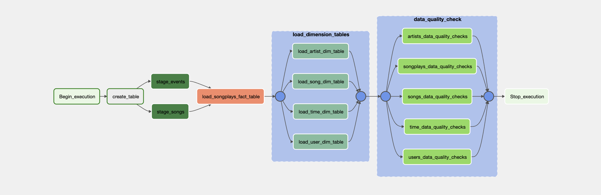

# SPARKIFY-DATA-PIPELINE

## Business Context
A music streaming company, `Sparkify`, has decided that it is time to introduce more automation and monitoring to their data warehouse ETL pipelines and come to the conclusion that the best tool to achieve this is Apache Airflow.

## Prerequisites
* Connect Airflow and AWS
* Connect Airflow to the AWS Redshift Cluster

## Source Data
The source data resides in S3 and needs to be processed in Sparkify's data warehouse in Amazon Redshift. The source datasets consist of JSON logs that tell about user activity in the application and JSON metadata about the songs the users listen to.
* Log data: s3://udacity-dend/log_data
* Song data: s3://udacity-dend/song_data

## Workflow

